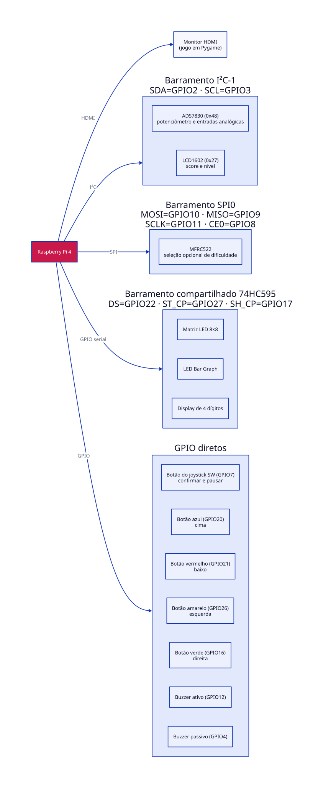
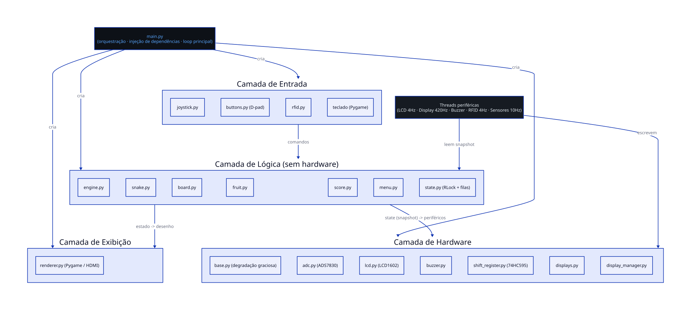
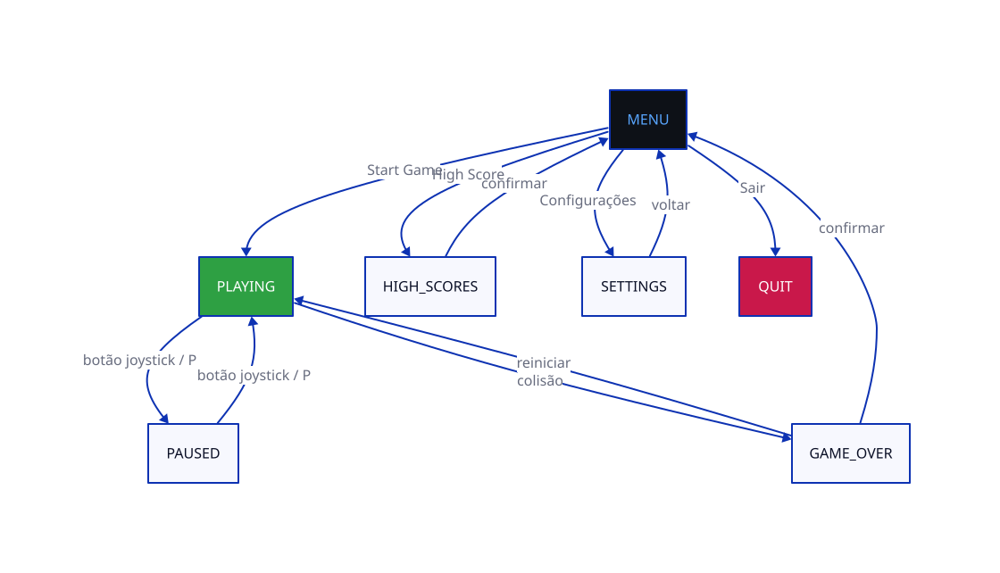
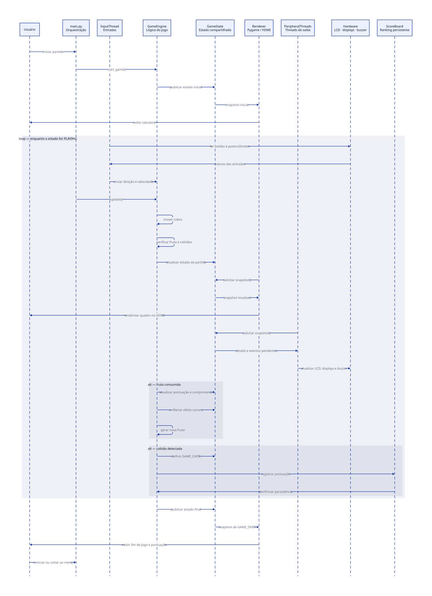

# Snake Pi — Relatório do Projeto

**Disciplina:** Laboratório de Processadores — Escola Politécnica da USP  
**Grupo:** Ana Paula Arejano (13680289), Carolina Tavares Duarte (12690963), Paulo Henrique Mota de Oliveira (14601816)

**Plataforma:** Raspberry Pi 4 + Freenove Projects Board for Raspberry Pi v1.2

---

# 1. Motivação

O projeto **Snake Pi** integra conceitos de sistemas embarcados, concorrência, arquitetura de software e desenvolvimento modular em uma aplicação única. O objetivo foi explorar os barramentos GPIO, I²C e SPI, bem como o uso do registrador de deslocamento 74HC595, mantendo a lógica do jogo desacoplada do hardware para facilitar testes, manutenção e evolução do sistema.

---

# 2. Objetivos

## Objetivo geral

Desenvolver uma versão do jogo Snake executada em Raspberry Pi 4, utilizando o monitor HDMI como interface principal e os periféricos da Freenove Projects Board como interface física complementar.

## Objetivos específicos

1. Implementar a lógica do jogo de forma modular e independente do hardware.
2. Integrar botões físicos, potenciômetro, LCD1602 e RFID opcional.
3. Controlar o display de quatro dígitos e sete segmentos por meio do registrador 74HC595.
4. Utilizar threads para desacoplar os periféricos do laço principal.
5. Persistir e ordenar o ranking em arquivo JSON.
6. Implementar degradação graciosa para periféricos indisponíveis.

---

# 3. Requisitos Funcionais

| ID | Requisito | Status |
|----|-----------|:------:|
| RF01 | Menu inicial | ✅ |
| RF02 | Movimento da cobra | ✅ |
| RF03 | Crescimento ao comer frutas | ✅ |
| RF04 | Geração aleatória de frutas | ✅ |
| RF05 | Colisão com paredes | ✅ |
| RF06 | Colisão com a própria cobra | ✅ |
| RF07 | Game Over e reinício | ✅ |
| RF08 | Controle por botões físicos e teclado | ✅ |
| RF09 | Botão do joystick para confirmação e pausa | ✅ |
| RF10 | Exibição de informações no LCD1602 | ✅ |
| RF11 | Seleção opcional de dificuldade via RFID | ✅ |
| RF12 | Efeitos sonoros | ✅ |
| RF13 | Exibição da pontuação no display de quatro dígitos | ✅ |
| RF14 | Ajuste da velocidade pelo potenciômetro | ✅ |
| RF15 | Sistema de níveis | ✅ |
| RF16 | Frutas especiais | ✅ |
| RF17 | Obstáculos conforme a dificuldade | ✅ |
| RF18 | Ranking persistente | ✅ |

---

# 4. Requisitos Não Funcionais

| ID | Requisito | Status |
|----|-----------|:------:|
| RNF01 | Execução em Raspberry Pi OS Bookworm com Python 3.11 | ✅ |
| RNF02 | Interface gráfica em monitor HDMI | ✅ |
| RNF03 | Degradação graciosa para periféricos indisponíveis | ✅ |
| RNF04 | Código modular e baixo acoplamento | ✅ |
| RNF05 | Execução em modo simulado | ✅ |
| RNF06 | Configuração centralizada | ✅ |
| RNF07 | Uso de PEP 8, type hints e docstrings | ✅ |
| RNF08 | Concorrência por threads | ✅ |
| RNF09 | Encerramento seguro dos recursos | ✅ |
| RNF10 | Atualização estável do display de quatro dígitos | ✅ |

---

# 5. Diagramas

## Arquitetura Física



## Arquitetura de Software



## Máquina de Estados



## Diagrama de Sequência



---

# 6. Ferramentas Utilizadas

## Linguagens

- Python 3.11
- D2
- Markdown
- LaTeX

## Bibliotecas

- pygame
- gpiozero
- lgpio
- smbus2
- spidev
- mfrc522
- unittest

## Hardware

- Raspberry Pi 4
- Freenove Projects Board v1.2
- ADS7830
- LCD1602
- Display de quatro dígitos e sete segmentos
- 74HC595
- Botões físicos
- Botão do joystick
- Potenciômetro
- Buzzers ativo e passivo
- RFID (opcional)

---

# 7. Metodologia

O desenvolvimento foi realizado de forma incremental utilizando Git, branches, Pull Requests, Releases e revisão por pares por meio de GitHub Issues.

A lógica do jogo foi desenvolvida separadamente do hardware, permitindo testes automatizados e execução em modo simulado. Posteriormente foram integrados os periféricos físicos e validado o funcionamento do display de quatro dígitos controlado pelo registrador 74HC595.

---

# 8. Testes

## Estratégia

A validação combinou testes automatizados, execução em modo simulado e testes na Raspberry Pi.

## Rastreabilidade

| Requisito | Evidência |
|-----------|-----------|
| RF01–RF09 | Testes da lógica do jogo |
| RF10 | Testes do LCD |
| RF11 | Testes do RFID |
| RF13 | Testes do display |
| RF14–RF17 | Testes funcionais |
| RF18 | Ranking |
| RNF03 | Degradação graciosa |
| RNF05 | Execução sem hardware |

## Testes de Hardware

| Componente | Resultado |
|------------|-----------|
| ADS7830 | ✅ |
| Potenciômetro | ✅ |
| Botões físicos | ✅ |
| Botão do joystick | ✅ |
| Buzzers | ✅ |
| Display de quatro dígitos | ✅ |

Foram executados **34 testes automatizados**, todos aprovados.

```bash
python3 tests/test_game_logic.py -v
```

---

# 9. Conclusão

O projeto atingiu os objetivos propostos ao integrar diferentes periféricos da Freenove Projects Board em uma arquitetura modular, desacoplada e testável.

A utilização de threads permitiu separar a lógica principal das rotinas de entrada e saída, mantendo a aplicação responsiva.

Durante o desenvolvimento foram identificadas limitações relacionadas ao compartilhamento do barramento do 74HC595 e ao uso simultâneo de GPIOs, tratadas por configuração centralizada e degradação graciosa.

Como trabalhos futuros destacam-se a validação completa do RFID, melhorias no LCD, novos modos de jogo e integração de outros sensores disponíveis na placa.

---

# Referências

- Freenove Projects Kit for Raspberry Pi
- Raspberry Pi Documentation
- Python 3.11 Documentation
- Pygame Documentation
- GPIO Zero Documentation
- Datasheet ADS7830
- Datasheet 74HC595
- Datasheet HD44780
- Datasheet MFRC522
